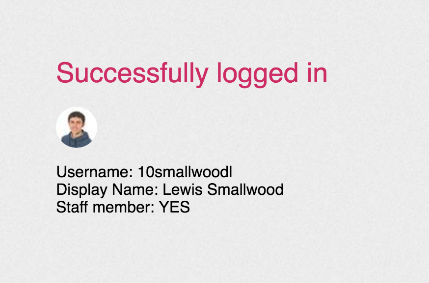
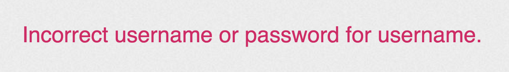

External-Logins-via-PHP-to-Firefly
==================================

This is a PHP class for getting user details from a Firefly page. It is a custom, very hacky, external logon authenticator.

Written by Lewis Smallwood on 5th May 2014 and modified on 6th May 2016 - http://www.bespoketechlabs.co.uk/

The PHP file called login.php contains the class `FireFlyUserLogin` which takes four parameters when initialising.

Username, Password, LoginPage, and NextPage.

* **Username** - Your Firefly account username.
* **Password** - Your Firefly account password.
* **LoginPage** - A link to the page in which you login to Firefly.
e.g. `https://firefly.clevedonschool.org.uk/login/login.aspx?prelogin=https%3a%2f%2ffirefly.clevedonschool.org.uk%2fdashboard&kr=ActiveDirectoryKeyRing`
* **NextPage** - A link to the page that follows when a login is complete. This is the same as "prelogin" passed in the previous url
e.g. `https://firefly.clevedonschool.org.uk/dashboard`

This file should generally be hosted on a separate server to your Firefly virtual machine where you wish to make the request between systems however it can have a range of purposes.

This code was originally used as a method of authenticating users through a separate web interface. This code takes the username and password and then POSTS the contents to the specified Firefly server. The response will then be interpretted and returned if the Firefly login was successful.

The class has been modified to grab extra user details.
There is an example implementation shown in `example.php`. The result of this running successfully retured:

**Example of a successful login**

**Example of a failed login**

I would like to point out that this code is still used for testing purposes within a school environment and could change depending on Firefly Encryption methods and updates. But not bad for a "stab in the dark"! I hope this code may be useful to solve some challenges other developers may be facing.

Finally, Firefly is the respective property of Firefly Solutions LLP. (2016). I would highly suggest crediting them whenever this is used.

Lewis Smallwood

**Bespoke Technology Labs**

Footnote: Please bare in mind I was aged 15 when I created this code hence I cannot guarantee any level of reliability in this solution. I provide this code as-is, it can be used at your own risk.